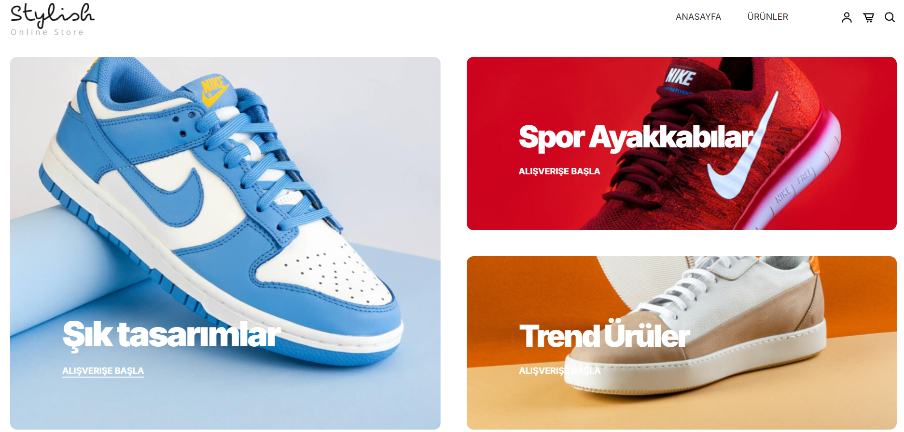
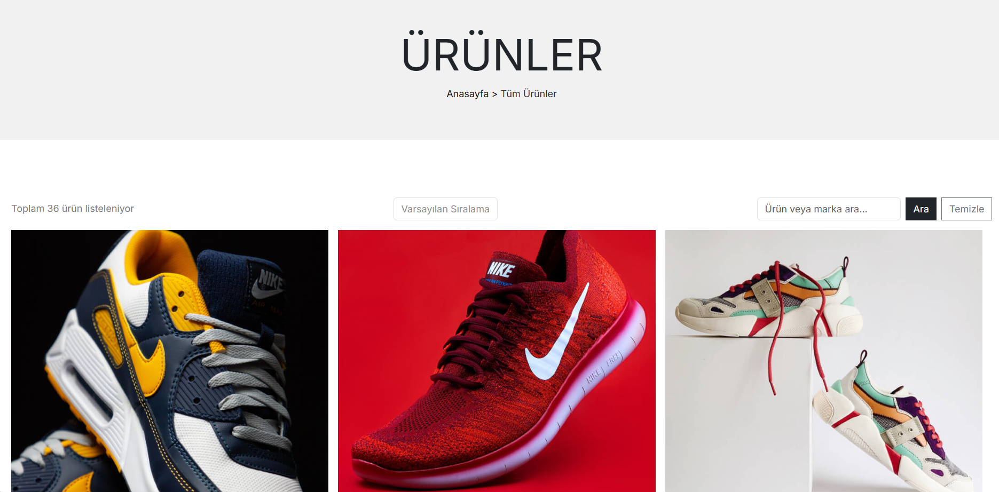
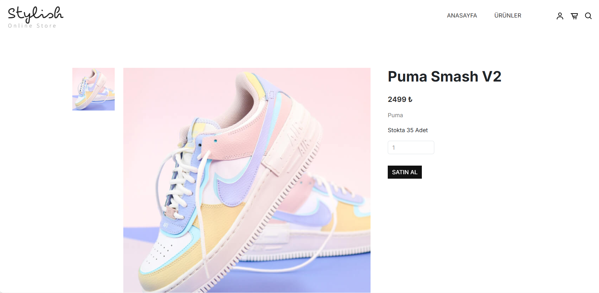
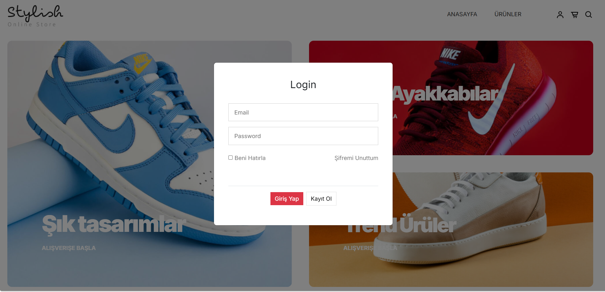
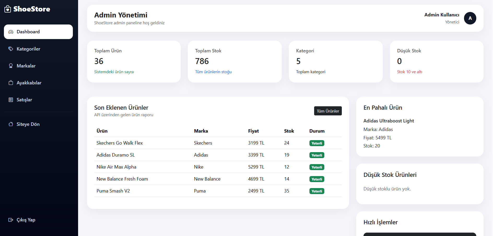
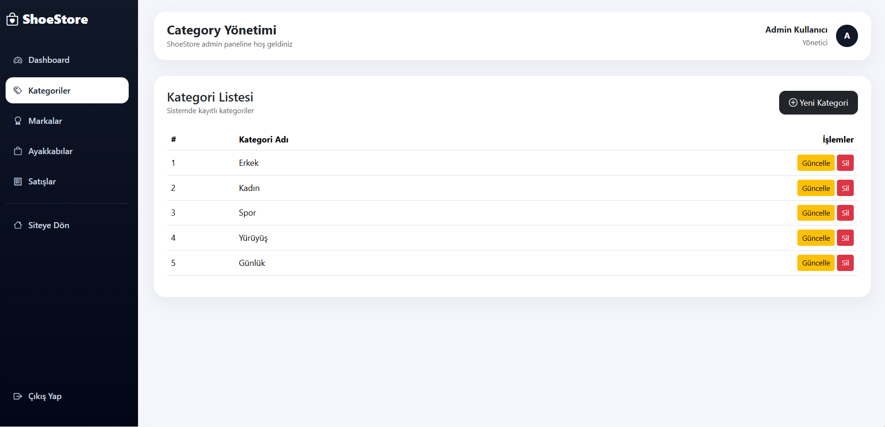
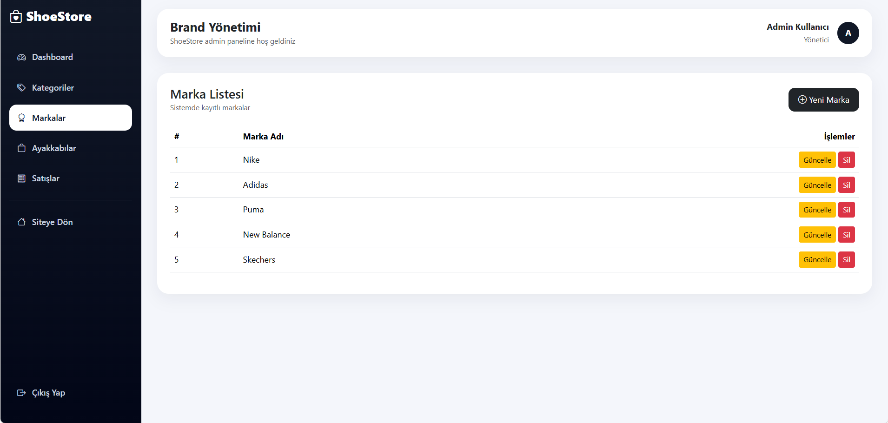
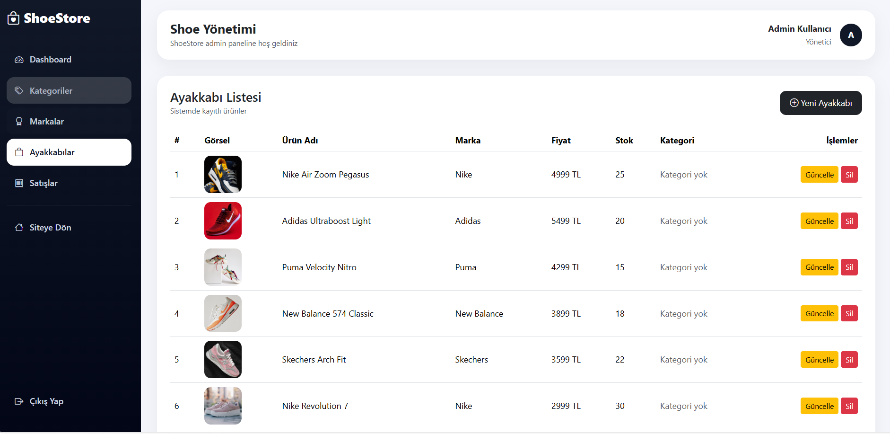
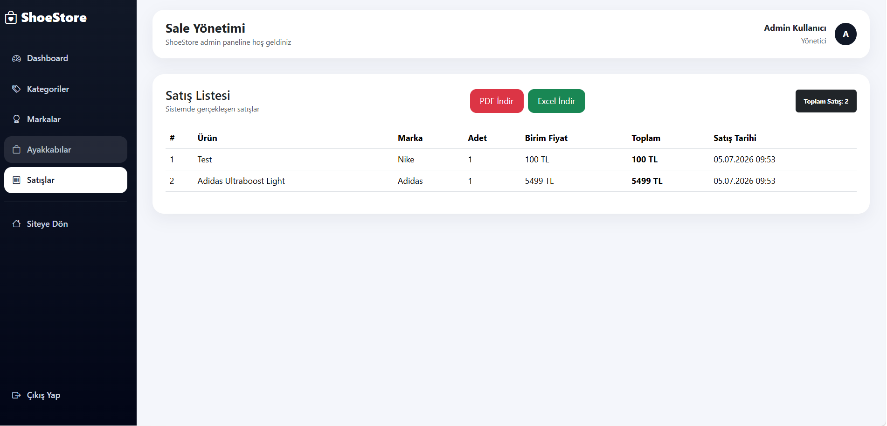

<!-- HEADER -->

<div align="center">

# 👟 ShoeStore

### Modern Shoe E-Commerce Platform with ASP.NET Core MVC & Web API

A full-stack shoe shopping application built using ASP.NET Core MVC, ASP.NET Core Web API, Entity Framework Core and Identity Authentication.

---


</div>

---

# 📸 Project Screenshots

## Home Page



---

## Products



---

## Product Detail



---

## Login



---


## Admin Dashboard



---

## Category Management



---

## Brand Management



---

## Product Management



---

## Sales Management



---

# 🚀 Project Features

### 👤 User Side

- Home Page
- Product Listing
- Product Detail
- Product Search
- Product Sorting
- Login
- Register
- Forgot Password
- Identity Authentication

---

### 🛠 Admin Panel

- Dashboard
- Category CRUD
- Brand CRUD
- Product CRUD
- Sales Report
- PDF Export
- Excel Export

---

### 🔗 API

- Category API
- Brand API
- Shoe API
- Sales API

---

# 🏗 Project Architecture

```
ShoeStore

│

├── ShoeStoreApi

│ ├── Entity Framework Core

│ ├── SQL Server

│ ├── REST API

│ └── CRUD Operations

│

└── ShoeStoreMvc

├── ASP.NET Core MVC

├── Identity

├── HttpClient

├── Admin Dashboard

└── API Consumption
```

---

# 🛠 Technologies

| Backend | Frontend | Database | Other |
|----------|----------|----------|--------|
| ASP.NET Core 10 | MVC | SQL Server | Identity |
| Web API | Bootstrap 5 | EF Core | HttpClient |
| C# | JavaScript | LINQ | Newtonsoft.Json |
| REST API | HTML5 | Code First | QuestPDF |
| Repository Pattern | CSS3 | Migration | EPPlus |

---

# 📊 Modules

✔ Authentication

✔ Authorization

✔ Admin Dashboard

✔ Category Management

✔ Brand Management

✔ Product Management

✔ Product Detail

✔ Search

✔ Sorting

✔ Sales Management

✔ PDF Export

✔ Excel Export

---

# 📂 Database Tables

| Table |
|---------|
| Categories |
| Brands |
| Shoes |
| Sales |
| AspNetUsers |
| AspNetRoles |
| AspNetUserRoles |

---

# 🎯 Learning Outcomes

- ASP.NET Core MVC
- ASP.NET Core Web API
- REST API Consumption
- Entity Framework Core
- Identity Authentication
- CRUD Operations
- Admin Dashboard Design
- PDF Report Generation
- Excel Report Generation
- Search & Sorting
- Responsive Design

---

# ⭐ Project Status

✅ Completed

---

<div align="center">

Made with ❤️ using ASP.NET Core MVC & Web API

</div>
